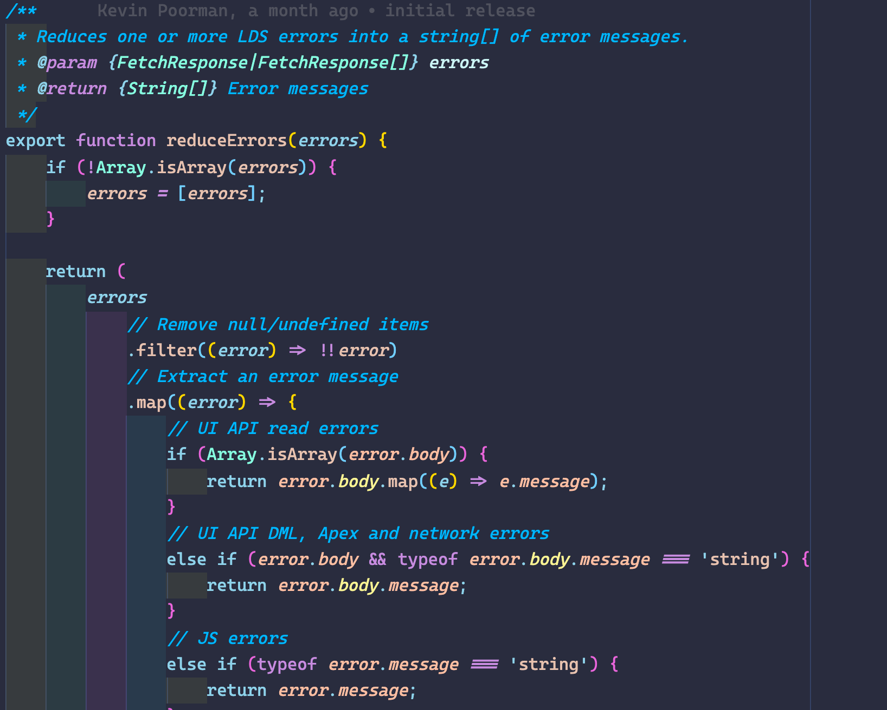
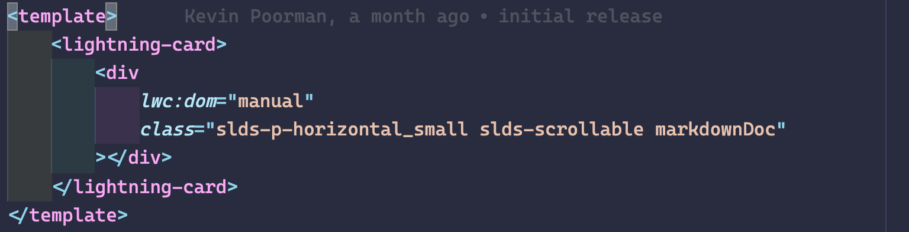

# Codey's In Bed By 10pm

This is my first VS Code Theme. Special thanks to [@sdras](https://github.com/sdras) for [her article on how to make VS Code Themes](https://css-tricks.com/creating-a-vs-code-theme/) and for the basis of this theme: [In Bed By 7pm](https://github.com/sdras/inbedby7pm)

## About this theme

### For Salesforce Development

This theme was designed around the specific needs of Salesforce developers and features color and font emphasis selections specifically for Apex, Javascript, html and css.

### Accessible

This theme has been built, from the ground up with accessibility in mind. It exceeds contrast minimums by at least 1 point for every combination.

### For Code Comprehension

Emphasis has been made on Comments - keeping them at the forefront of the editor.

# Screenshots

## Apex

## LWC Javascript

## LWC Html

# Installation

1.  Install [Visual Studio Code](https://code.visualstudio.com/)
2.  Launch Visual Studio Code
3.  Choose **Extensions** from menu
4.  Search for `codeys in bed by 10`
5.  Click **Install** to install it
6.  Click **Reload** to reload the Code
7.  From the menu bar click: Code > Preferences > Color Theme > **Codey's in bed by 10**

Suggestions and contributions welcome :)
